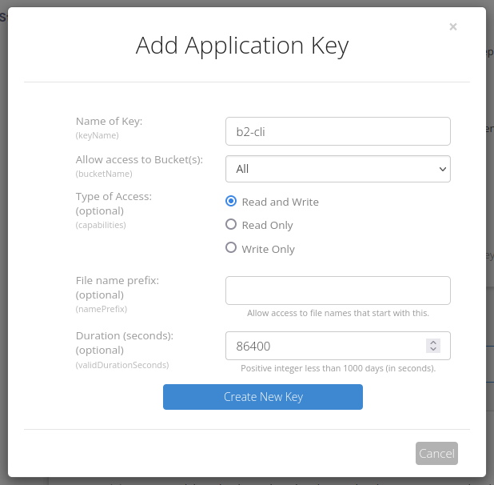
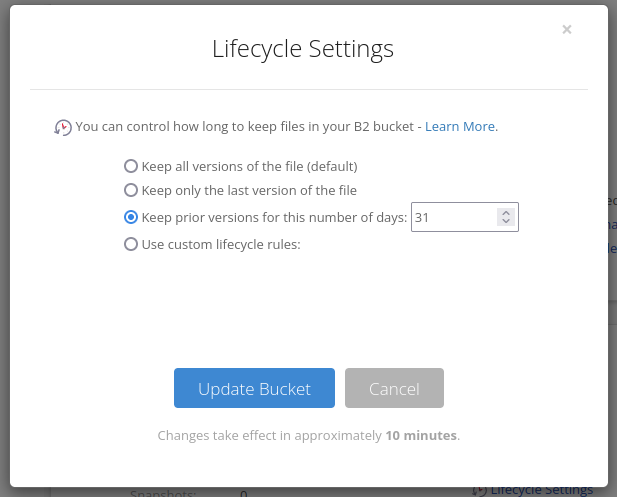


**tl;dr:**
Use B2's [app key capabilities](https://www.backblaze.com/docs/cloud-storage-application-key-capabilities) to prevent an attacker from deleting backups. Use [lifecycle rules](https://www.backblaze.com/docs/cloud-storage-lifecycle-rules) to prevent storing deleted files indefinitely.


I've recently begun exposing some of my homelab services to the Internet for the first time. It's got me thinking more deliberately about how I'm protecting my data from potential attacks. By assuming that server compromise is a questions of *when* and not *if*, you can put yourselves into the shoes of an attacker and consider how to protect yourself.

This article specifically explains how to secure your backups in [Backblaze B2](https://www.backblaze.com/cloud-storage) to protect them even in the case that your server is compromised. I'll lay out the scenario using [rclone](https://rclone.org/) as the backup software, but the steps are applicable to most clients using B2's [application keys](https://www.backblaze.com/docs/cloud-storage-application-keys) to authenticate.

# The problem: backup deletion

Let's assume for a moment that a storage server is compromised. The server has a nightly cron job that pushes nightly backups to B2 with `rclone`. If the application key in question is one created through Backblaze web UI, it has the ability to delete files. The attacker can use the key to run `rclone delete --b2-hard-delete <bucket path>` and trash its data. So much for backups.

## Solution: App key capabilities

You can prevent this scenario by using [B2's application key capabilities](https://www.backblaze.com/docs/cloud-storage-application-key-capabilities). By creating an app key that's only permitted to do exactly what it needs to, we can thwart our attacker.

But what capabilities exactly does it need to do? To identify that, it's first necessary to understand the two ways B2 provides to delete a file:

- **Hide:** A new version of the file (with no contents) is uploaded, then marked as hidden. This is the default action `rclone` takes to delete files in B2. Think of it as a "soft deletion." Old versions ares still recoverable (per the [lifecycle rules]( "About Us") discussed below).
- **Delete**: This deletes a specified file versions in an unrecoverable fashion. `rclone` does this for every version of a file when `--b2-hard-delete` is specified.

So if we create an app key that can *hide*, but not *delete* files, we can thwart even the most determined attacker. In B2, these are conveniently controlled by two distinct app key capabilities: `writeFiles` allows hiding, but not deleting, while `deleteFiles` allows exactly what it says.

Unfortunately, we can't do this from B2's web interface, which provides only three presets for the app key's capabilities. Even the "Write Only" preset includes permission to delete files. We have to use [the B2 CLI](https://www.backblaze.com/docs/cloud-storage-command-line-tools) for the task. You'll need to authenticate to it with an existing key that has the `writeKeys` capability - you can either use your master application key (not recommended), or make a new key with "Read and Write" access that's not limited to a particular bucket, as shown below:




**Powerful app keys**
Since we're going to need an app key that has the ability to create new app keys, perform these steps on a machine you trust. If you leave this app key on your server, you're gonna have a bad time.

Even better, use an app key that has a short duration (like the 24 hours shown above), and delete the cached credentials from your workstation when you're done with `rm ~/.b2_account_info`.


Once you're authenticated with the CLI, create an application key to use for your backups. Make it restricted to a single bucket, and grant it only the capabilities it needs:

```shell-session
[aven@titania]% b2 create-key --bucket <bucket_name> <key_name> listFiles,writeFiles
```

The CLI will print the app key ID, followed by the app key itself. Let's go ahead and verify it's behaving correctly with `rclone`. I configured a new remote called `b2-testing` using the new app key, then ran some tests:

```shell-session
[aven@titania]% ls                           
important_file  irreplaceable_memories  precious_data
[aven@titania]% rclone ls b2-testing:$BUCKET
<no output>
[aven@titania]% rclone sync . b2-testing:$BUCKET
[aven@titania]% rclone ls b2-testing:$BUCKET 
  1048576 important_file
  1048576 irreplaceable_memories
  1048576 precious_data
```

So far so good - we've backed up our files. Now, let's put on our attacker hat and try to wipe them out:

```shell-session
[aven@titania]% rclone delete --b2-hard-delete b2-testing:$BUCKET
2023/07/25 16:52:46 ERROR : important_file: Couldn't delete: failed to delete "important_file": Unknown 401  (401 unauthorized)
...
2023/07/25 16:52:51 Failed to delete with 4 errors: last error was: failed to delete 3 files
```

Excellent, we wanted that to fail. We can still "soft delete" (hide) our files

```shell-session
[aven@titania]% rclone delete b2-testing:$BUCKET
[aven@titania]% rclone ls b2-testing:$BUCKET
<no output>
[aven@titania]% rclone ls --b2-versions b2-testing:$BUCKET
  1048576 important_file-v2023-07-25-215034-598
  1048576 irreplaceable_memories-v2023-07-25-215034-545
  1048576 precious_data-v2023-07-25-215034-480
```

Perfect! The old versions of our files are still present and recoverable, just hidden.

### Lifecycle rules

Of course, it would be nice not to pay to store every deleted file forever. You can use [B2's lifecycle rules](https://www.backblaze.com/docs/cloud-storage-lifecycle-rules) to  facilitate this. If, for example, you configure a bucket as shown below, hidden files will be kept for a month, then deleted permanently. In combination with our limited app key, this means you'd have a month to notice that your files were missing before they'd be unrecoverable:




**Language clarification**
While the web UI says "Keep prior versions for this number of days", this setting maps to `daysFromHidingToDeleting`, as noted [in the documentation](https://www.backblaze.com/docs/cloud-storage-lifecycle-rules#construct-a-lifecycle-rule). In my mind, the latter is a bit clearer on what's actually happening: `n` days after a file is "soft deleted" (hidden), it's permanently deleted.


There's much more to lifecycle rules, but that probably merits a blog post of its own.

## Conclusion

I hope this helps illustrate the importance of having backups that can't be easily deleted. If you're using a different service than B2, you can likely apply similar principles to your environment (though I'm shocked you've made it this far in my article). 