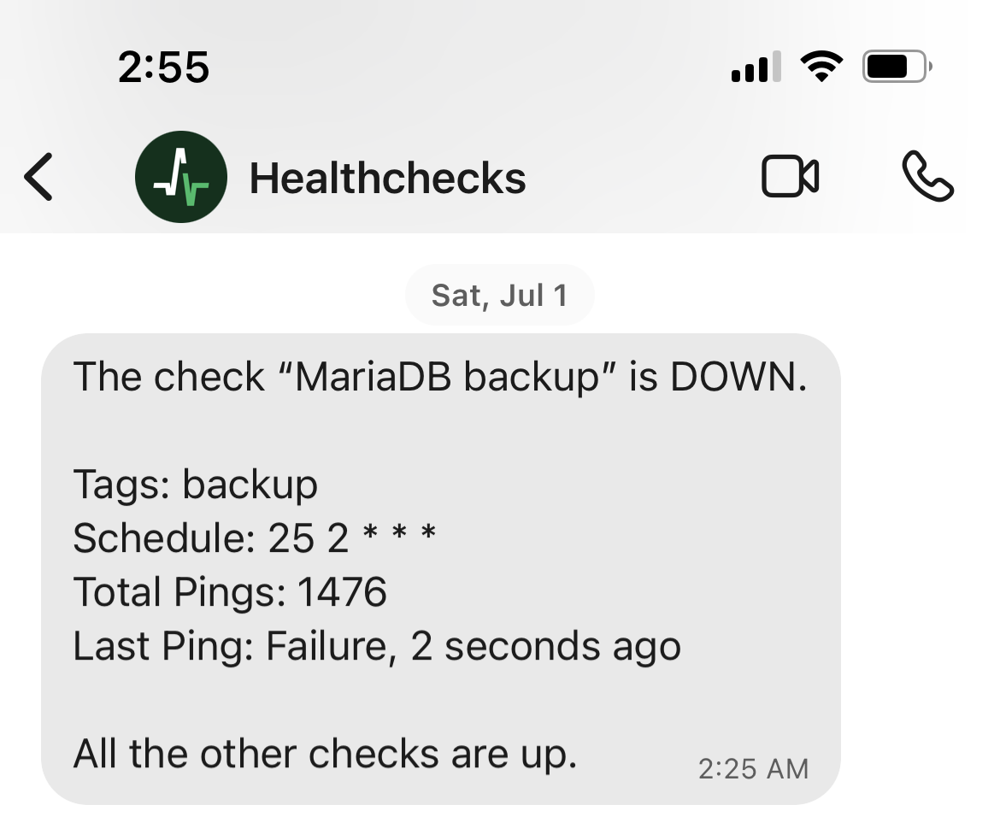
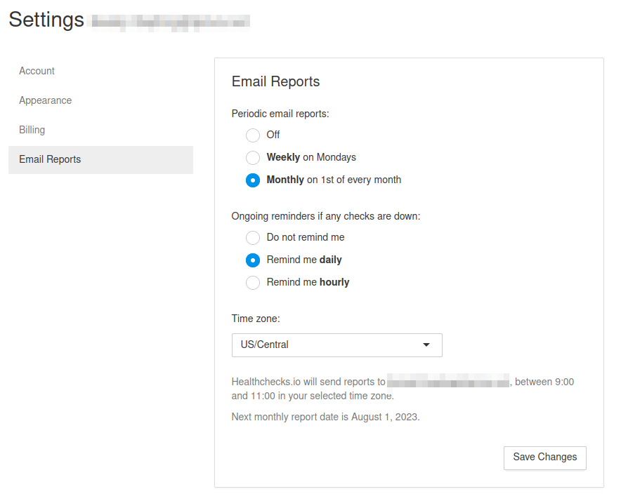
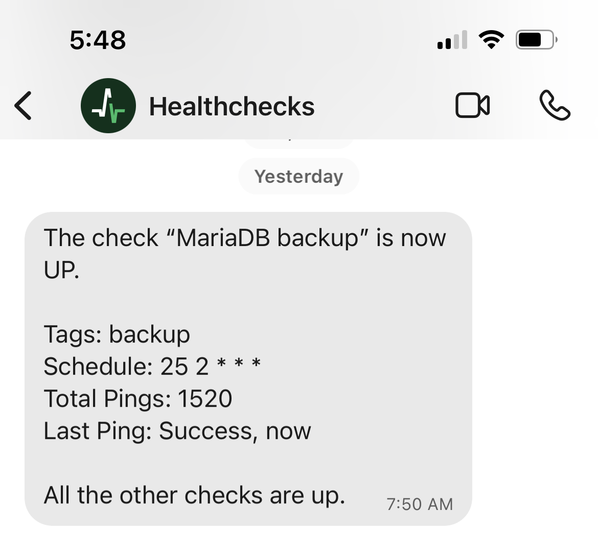


**tl;dr:**
Don't put yourself in a position where you ignore alerts. Don't update your software without reading release notes. And especially don't make assumptions about error handling in bash scripts!


I recently discovered a failing backup that, upon deeper investigation, turned out to be a chain of three failures. I'll explore how it happened, why it went on for far longer than I initially thought, and what fixes I identified. It's my hope that this will serve both as an example of what not to do, and perhaps provide a timely reminder to someone to take a peek at their backups.

The backup in question is for the MariaDB database used by my homelab's Nextcloud instance. In addition to metadata about the Nextcloud's files (which are themselves backed up by a separate job), this backup contains my calendar and contacts, two things I'd be rather irked about losing. The advice, however, is general enough to be applicable to other backups as well. I'm assuming a level of familiarity with Docker and bash scripting.

## Mistake #1: Ignored alerts

On July 1, 2023, I got a notification from [Healthchecks.io](https://healthchecks.io/) that one of my long-running backup cron jobs had failed:



I'll give myself some credit here: setting up alerts for failing jobs prevented this issue from persisting much longer than it could have.

I get these alerts occasionally. In particular, a different backup job that uses [rclone](https://rclone.org/) to upload backups to [Backblaze B2](https://www.backblaze.com/cloud-storage) is occasionally stymied by files changing while it's trying to upload them . Since the backups are made daily, a one-off transient failure isn't a cause for alarm.

Unfortunately, this meant I was accustomed to ignoring occasional alerts - **mistake #1**. I had put myself in a position where I had to realize a check had been failing for multiple days, despite only receiving a single alert on the first day.

### Fix action #1

Healthchecks can be configured to send daily email alerts for failing checks, which will be much harder for me to tune out.



Of course, the true solution to [alert fatigue](https://en.wikipedia.org/wiki/Alarm_fatigue) is *fewer* alerts, not more. I should also spend some time investigating the transient backup failures. Maybe I should implement a nightly maintenance window in which my containers are shut down to avoid files changing during backup upload. I'm hesitant to increase the complexity of the backup process, though. I'll have to consider this further.

## Mistake #2: Reckless updates

Fast forward about three weeks. I was poking around in Healthchecks for unrelated reasons when I noticed the failing check and started to investigate. Let's run the failing script (explored in greater detail later):

```shell-session
[root@apps] # ./bad_backup.sh              
Could not open input file: /config/www/nextcloud/occ
At least one item failed.
```

It looks like Nextcloud's `occ` command has moved. Some poking around reveals this is an result of the [LinuxServer.io](https://linuxserver.io) team (whose Docker image I use) changing the way the Nextcloud images is built. [They'd announced the change](https://info.linuxserver.io/issues/2023-06-25-nextcloud/), but I'd neither been notified nor thought to check before upgrading. **Mistake #2**.

I know that [using the `latest` tag](https://github.com/subract/ansible/blob/f7cba8eda3183ed0a190df1bb9f1192a9394b6f1/templates/apps/core.yml#L63) for my images comes with risks for uptime. It's a decision I'd avoid if I were hosting for more than immediate family. It's fairly common for me to pull new Docker images and have a container fail to start. For my homelab environment, this isn't a huge deal - I'd peek at the logs, pull up the release notes , remedy the issue, and be on my merry way. I hadn't considered the implications this lax behavior has for my backups, however.

My first thought was to lock Nextcloud's Docker image to a particular major version - which seemed to balance the convenience of easy updates with the risk of breaking changes. Unfortunately, LinuxServer.io doesn't publish major version tags. In other words, it's either `image: linuxserver/nextcloud:latest` or `image: linuxserver/nextcloud:27.0.1`, not something like `image: linuxserver/nextcloud:27` (as many other container builders support). Faced with this limitation, I settled on...

### Fix action #2

I decided that increased awareness of my image's potential breaking changes was the biggest pain point I could address. I resolved to set up an RSS reader (something I'd been intending to get around to for some time) and subscribe to [LinuxServer.io's feed](https://info.linuxserver.io/affected/nextcloud/) for potentially breaking changes to their images. Since this will only notify me about changes to the image, and not Nextcloud itself, I'll also subscribe to the [Nextcloud blog](https://nextcloud.com/blog/) feed, using the reader to filter for posts tagged `Release`.

The great thing about this fix is that it's broadly applicable to my other containers. Even those that don't publish a release blog can be added to a reader by using feeds automatically created for GitHub tags and releases, as succinctly explained by [Ronald Vilcins's Medium post](https://vilcins.medium.com/rss-feeds-for-your-github-releases-tags-and-activity-cbda2c51373).

I'll also investigate using a tool like [diun](https://crazymax.dev/diun/) to assist here.

## Mistake #3: Poor error handling

At this point, I'm missing about 22 days of backups. That's not ideal, but not the end of the world. As I'm patching up the previous issue, I discover a subtler, more insidious error in the backup script, which it's now relevant to explore. I've applied the fix for the the `occ` path issue explored above (and lightly edited for clarity):

```bash
#!/bin/bash

# Activate Nextcloud maintenance mode
docker exec nextcloud occ maintenance:mode --on &&

# Back up all databases
# Overwrite existing file, because zfs will keep local versions, and Backblaze will keep versions for 30 days
docker exec mariadb sh -c 'exec mysqldump --all-databases -uroot -p"$MYSQL_ROOT_PASSWORD"' | 
gzip > /ssd/app/mariadb/dumps/mariadb.sql.gz &&

# Disable Nextcloud maintenance mode
docker exec nextcloud occ maintenance:mode --off

# Signal success or failure to Healthchecks
url=https://hc-ping.com/{{ healthcheck_id_mariadb }}
if [[ $? -ne 0 ]] ; then
  echo At least one item failed.
  url=$url/fail
fi

curl -fsS --retry 3 $url > /dev/null
```

Sharp-eyed bash veterans may have spotted my mistake already. When I ran this version to verify that my fix for the `occ` issue had worked, I had a new error:

```shell-session
[root@apps] # ./bad_backup_v2.sh    
Maintenance mode enabled
sh: 1: exec: mysqldump: not found
Maintenance mode disabled
```

Disturbingly, my phone buzzed:




Wait, what? The script clearly errored, so why wasn't it caught? Turns out, I had misunderstood the way bash handles errors with pipes, behavior that's [well-documented in the manual](https://www.gnu.org/software/bash/manual/html_node/Pipelines.html):

> The exit status of a pipeline is the exit status of the last command in the pipeline, unless the `pipefail` option is enabled... If `pipefail` is enabled, the pipeline’s return status is the value of the last (rightmost) command to exit with a non-zero status, or zero if all commands exit successfully.

Because I was piping the output of `mysqldump` to `gzip`, the compound command returned a zero exit code despite the first half failing - **mistake #3**. If I had set `pipefail`, I would have avoided this issue:

```shell-session
[root@apps] # docker exec mariadb sh -c 'exec mysqldump --all-databases -uroot -p"$MYSQL_ROOT_PASSWORD"' | gzip > /ssd/app/mariadb/dumps/mariadb.sql.gz   
sh: 1: exec: mysqldump: not found
[root@apps] # echo $?
0

[root@apps] # set -o pipefail
[root@apps] # docker exec mariadb sh -c 'exec mysqldump --all-databases -uroot -p"$MYSQL_ROOT_PASSWORD"' | gzip > /ssd/app/mariadb/dumps/mariadb.sql.gz
sh: 1: exec: mysqldump: not found
[root@apps] # echo $?
127
```

Because of this failure, nothing was getting piped into `gzip`, and `gzip` was dutifully zipping up nothing. Notice the 20 byte size of the output file with its distinct lack of contents when unzipped:

```shell-session
[root@apps] # ls -lgo /ssd/app/mariadb/dumps/mariadb.sql.gz
-rw-r--r-- 1 20 Jul 22 18:05 /ssd/app/mariadb/dumps/mariadb.sql.gz
[root@apps] # gunzip /ssd/app/mariadb/dumps/mariadb.sql.gz --to-stdout
[root@apps] # 
```

How long has this been happening? Longer than the 30 day retention period I have Backblaze configured to retain old versions for - note the 20-byte file sizes all the way down:

```shell-session
[root@apps] # rclone ls --b2-versions b2-crypt:ssd/app/mariadb/dumps               
       20 mariadb.sql.gz
       20 mariadb.sql-v2023-06-30-103008-985.gz
       20 mariadb.sql-v2023-06-29-103012-474.gz
       20 mariadb.sql-v2023-06-28-103011-511.gz
       20 mariadb.sql-v2023-06-27-103010-151.gz
       20 mariadb.sql-v2023-06-26-103012-025.gz
       20 mariadb.sql-v2023-06-25-103008-967.gz
       20 mariadb.sql-v2023-06-24-103008-774.gz
       20 mariadb.sql-v2023-06-23-103010-725.gz
       20 mariadb.sql-v2023-06-22-103009-686.gz
       20 mariadb.sql-v2023-06-21-103008-406.gz
```

My [sanoid configuration](https://github.com/subract/ansible/blob/main/roles/syncoid_sanoid/files/sanoid.conf) that manages snapshots on my ZFS filesystem only keeps versions for a month as well. That means I have effectively had no backups of this database for at least a month - but how much longer than that?

To figure that out, I had to troubleshoot why the `mysqldump` command was failing in the first place. Some quick research led me to to answer: `mysqldump` had [been deprecated](https://mariadb.com/kb/en/mysqldump/) and replaced with `mariadb-dump` in the MariaDB 11.o.1 release. This really makes mistake #3 also **mistake #2.5**, since it's another "didn't read the release notes" sort of error.

I checked the date [on the release](https://mariadb.com/kb/en/mariadb-11-0-1-release-notes/): **February 22, 2023**.

At last, the magnitude of my failure was at last lade bare. As best I can tell, my backups have been failing for around half a year, and I had no idea until a *completely independent* failure finally triggered an alert - which I then ignored for three weeks.

### Fix action #3

I need to be testing how my scripts fail more thoroughly. I could have noticed this error if I had replaced commands with `false` to see how the errors were handled before considering the script complete. In this case, using `set -o pipefail` causes the error to propagate correctly.

Beyond the obvious "git gud at bash," , periodic validation of my backups would prove helpful. While I wouldn't have noticed that this file was missing - since it was present, just empty - I should probably be giving it a bit more attention. I can envision a checker script that does spot checks against error-prone parts of the backup.

Finally, because this mistake was also just mistake #2 in a trench coat trying to trick me, the same fix actions apply.

## Conclusions

I tend to think of backup jobs as requiring little to no maintenance, but that's clearly not always the case. This script worked when I wrote it, then broke years later. I failed to detect the breakage for months, then failed to act on it for weeks. Ultimately, this is part of the reason why I have [my homelab](https://github.com/subract/ansible/): to enable this sort of learning without breaking services others depend on.
